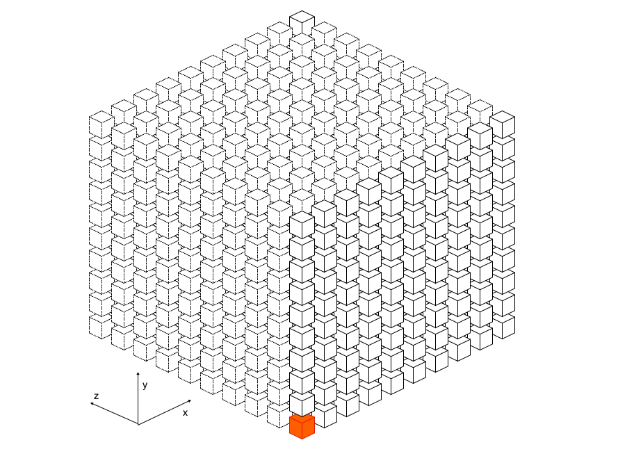
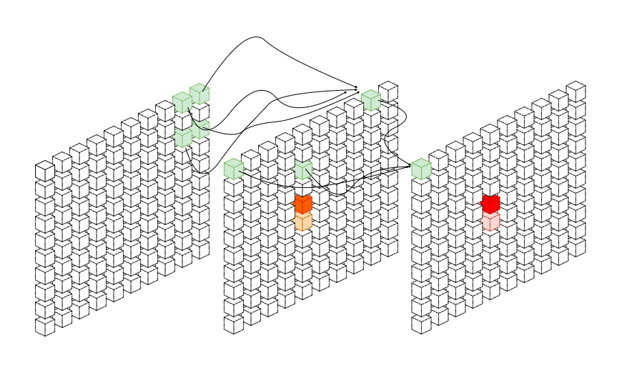

aria
=====

A AI system with wisdom

We want to build a matrix system. The matrix system has 1,000 machines. Each machine is a cellular automaton system. The cellular automaton system has another 1,000 * 1,000 * 1,000 neuron cells. These neuron cells are represented by squares. They will update the internal state according to corresponding rules, similar to the human brain, so as to build a truly intelligent artificial intelligence.  

Build
-----

    $ git clone https://github.com/aria-pro/aria.git
    
    $ cd aria
    
    $ rebar3 compile
    
    $ cd _build/default/lib/erocksdb/ && make
    
    $ rebar3 release
